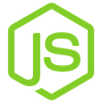
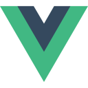

### Thanks for your visit my github! &nbsp; 👨👩
👀  My passion is to create beautiful, intuitive websites and applications, and to develop elegant solutions to complex problems.
  Programming is something anyone can do with PM skills, but it is difficult to find a programmer who can work on various projects clearly and neatly.
  My area of expertise is full stack (Angular, React, java and NodeJS, python...) technology, and I am also versed in Solidity and RUST coding.
  I have also experience developing hybrid apps for various projects including online payment solutions for well-known global companies.  
🌱  I'm striving to be a complete business software solution provider for blockchain and math.
  Since 2018, I have intelligently applied my technical, administrative, and customer service expertise to deliver continued business success to our clients.    
</h1>

### 𝐒𝐤𝐢𝐥𝐥s
<table>
  <tr>
      <td></td>
      <td></td>
      <td></td>
      <td></td>
      <td></td>
      <td></td>
      <td></td>
      <td></td>
      <td></td>
      <td></td>
      <td></td>
      <td></td>
  </tr>  
</table>
